% Gergely Daróczi
% Unified plots

This document demonstrates the features of unifying plots in `pander`. First, if you do not want to deal with styling each of your images, just activate it: `evalsOptions('graph.unify', TRUE)`.

*Note*: please install `lattice` and `ggplot2` on your computer prior to trying to run all examples of this document.

# Options

There are a bunch of options you might want to check out, these are:

  * graph.nomargin
  * graph.fontfamily
  * graph.fontcolor
  * graph.fontsize
  * graph.grid
  * graph.grid.minor
  * graph.grid.color
  * graph.grid.lty
  * graph.boxes
  * graph.legend.position
  * graph.background
  * graph.panel.background
  * graph.colors
  * graph.color.rnd
  * graph.axis.angle
  * graph.symbol

<!-- end of list -->

Find more details on [`pander`'s homepage](http://rapporter.github.com/pander/#pander-options).

# Default options

Not touching the above ones, let us check out how different plots look like by calling `base` R graphing function, `lattice` or `ggplot2`!

## Histogram

### Base R plot

[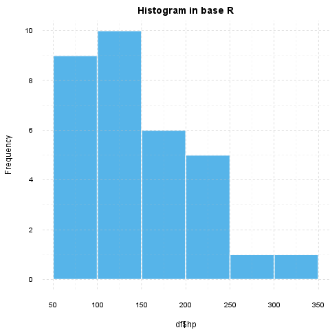](plots/graphs-1-hires.png)

### lattice

[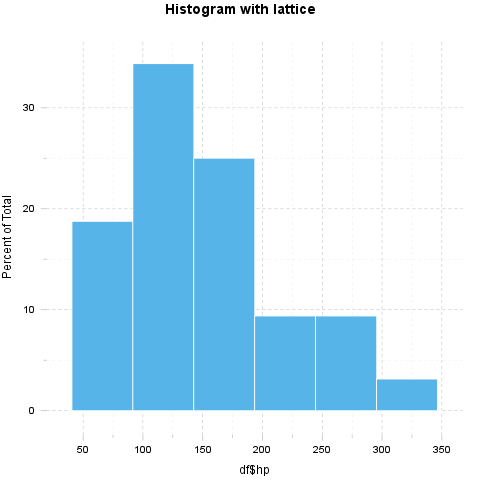](plots/graphs-2-hires.png)

### ggplot2

[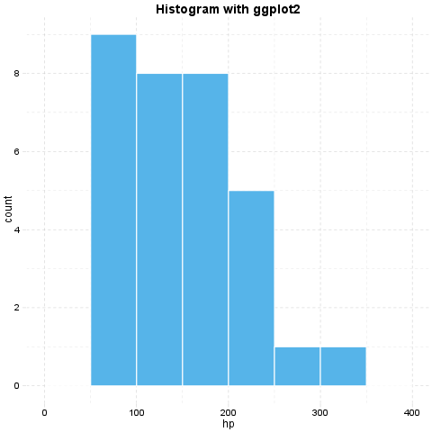](plots/graphs-3-hires.png)

## Barplot

### Base R plot

[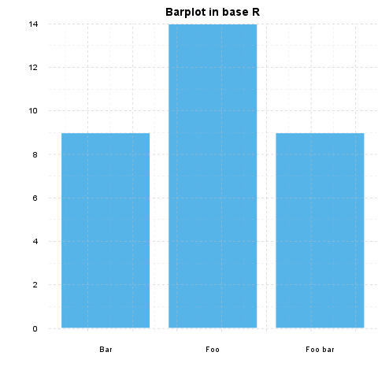](plots/graphs-4-hires.png)

### lattice

[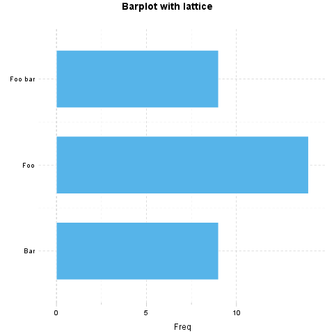](plots/graphs-5-hires.png)

### ggplot2

[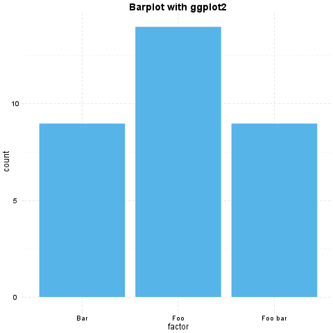](plots/graphs-6-hires.png)

## Points

### Base R plot

[](plots/graphs-7-hires.png)

### lattice

[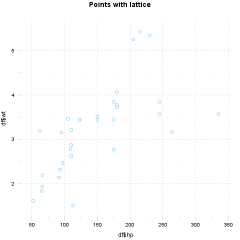](plots/graphs-8-hires.png)

### ggplot2

[](plots/graphs-9-hires.png)

## Grouped plot

### Base R plot

I have no idea how to do that besides manually adding `points`.

### lattice

[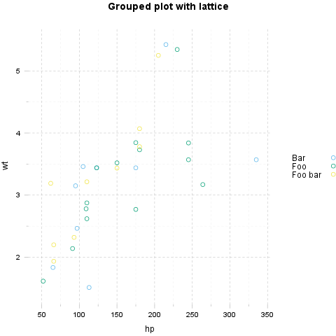](plots/graphs-10-hires.png)

### ggplot2

[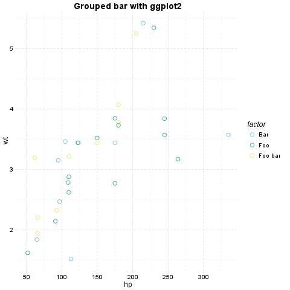](plots/graphs-11-hires.png)

## Facets

### Base R plot

I have no idea how to do that besides `par(mfrow=c(foo, bar))`.

### lattice

[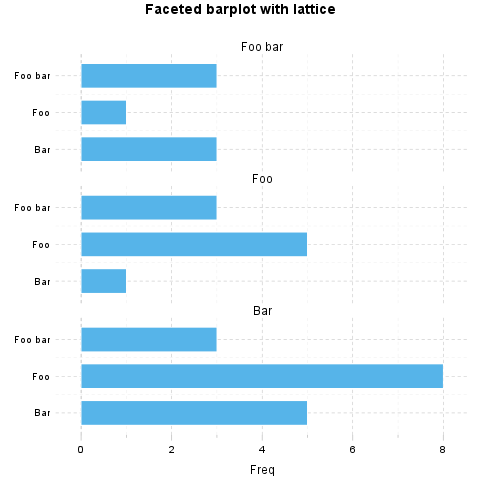](plots/graphs-12-hires.png)

### ggplot2

[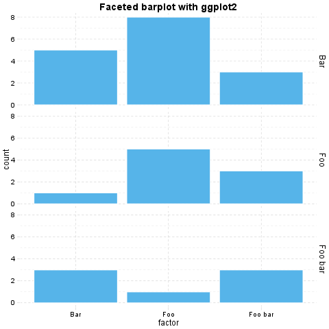](plots/graphs-13-hires.png)

## Boxplot

### Base R plot

[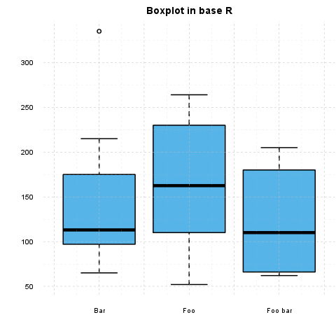](plots/graphs-14-hires.png)

### lattice

[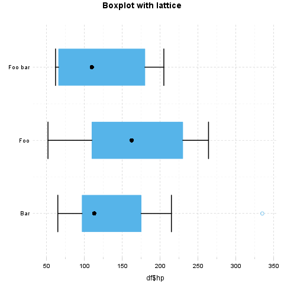](plots/graphs-15-hires.png)

### ggplot2

[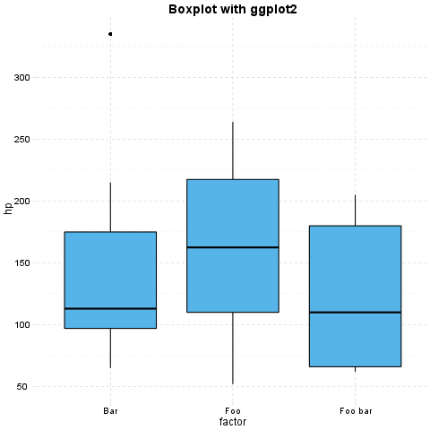](plots/graphs-16-hires.png)

## Lines

### Base R plot

[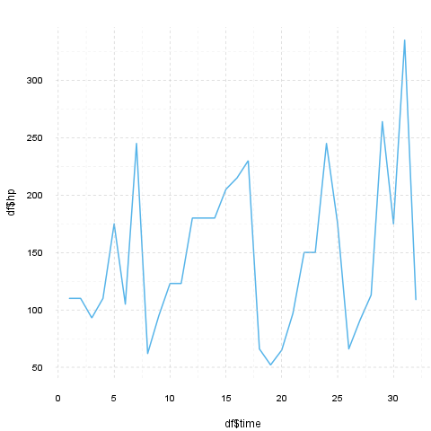](plots/graphs-17-hires.png)

### lattice

[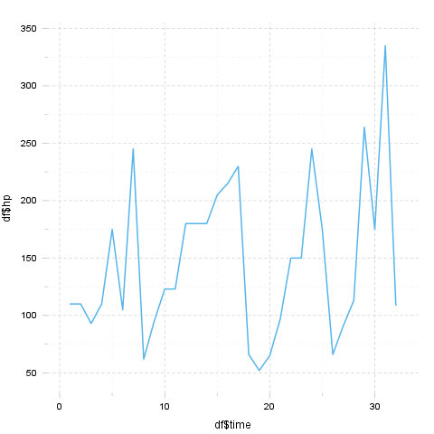](plots/graphs-18-hires.png)

### ggplot2

[](plots/graphs-19-hires.png)

# Custom options

Below you can find some images generated by the exact same commands but with some modified `panderOptions`:

```r
panderOptions('graph.fontfamily', "Comic Sans MS")
panderOptions('graph.fontsize', 18)
panderOptions('graph.fontcolor', 'blue')
panderOptions('graph.grid.color', 'blue')
panderOptions('graph.axis.angle', 3)
panderOptions('graph.boxes', T)
panderOptions('graph.legend.position', 'top')
panderOptions('graph.colors', rainbow(5))
panderOptions('graph.grid', FALSE)
panderOptions('graph.symbol', 22)
```

## Histogram

### Base R plot

[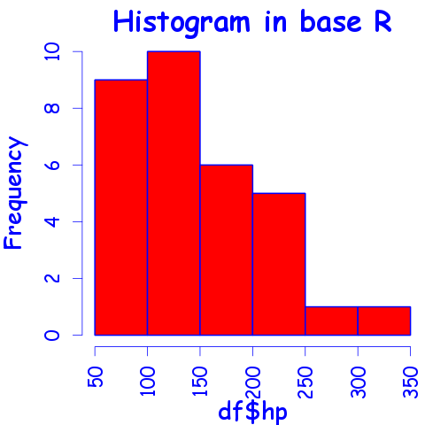](plots/graphs-20-hires.png)

### lattice

[](plots/graphs-21-hires.png)

### ggplot2

[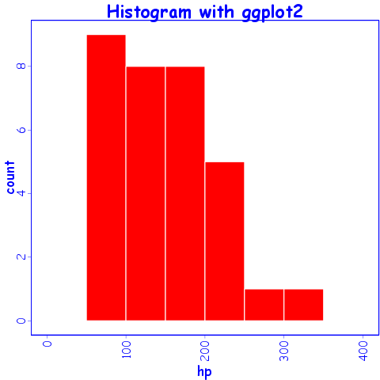](plots/graphs-22-hires.png)

## Barplot

### Base R plot

[](plots/graphs-23-hires.png)

Yeah, the "Foo bar" label is cropped. We need a custom `mar` option here:

[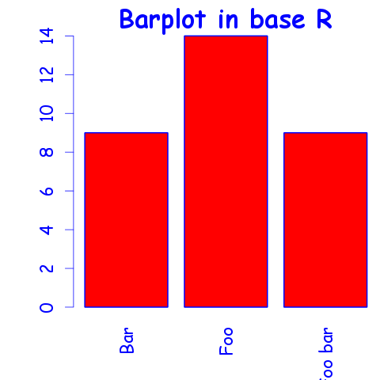](plots/graphs-24-hires.png)

But wait, we lost the color! Right: unfortunately coloring base R plots is really hackish, `pander` is adding the `col` attribute to the calls. If you start to tweak `par` in a chunk, you should prepare to some unwanted side-effects. Solution:

[](plots/graphs-25-hires.png)

### lattice

[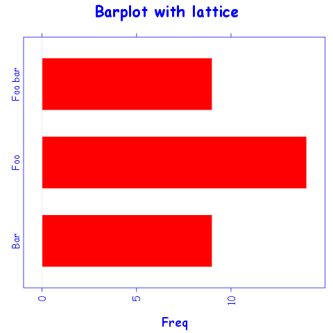](plots/graphs-26-hires.png)

### ggplot2

[](plots/graphs-27-hires.png)

## Points

### Base R plot

[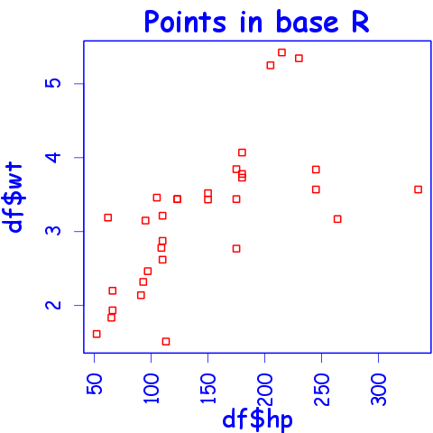](plots/graphs-28-hires.png)

### lattice

[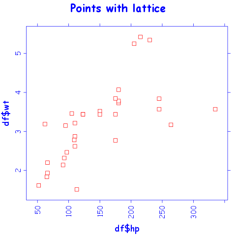](plots/graphs-29-hires.png)

### ggplot2

[](plots/graphs-30-hires.png)

## Grouped plot

### Base R plot

I have no idea how to do that besides manually adding `points`.

### lattice

[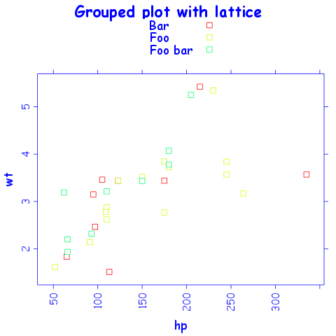](plots/graphs-31-hires.png)

### ggplot2

[](plots/graphs-32-hires.png)

## Facets

### Base R plot

I have no idea how to do that besides `par(mfrow=c(foo, bar))`.

### lattice

[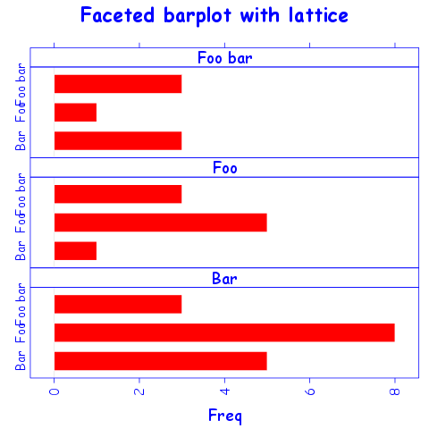](plots/graphs-33-hires.png)

### ggplot2

[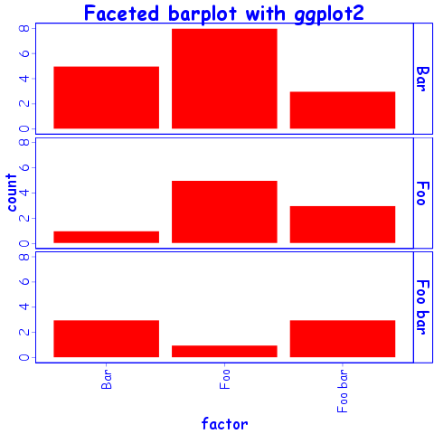](plots/graphs-34-hires.png)

## Boxplot

### Base R plot

[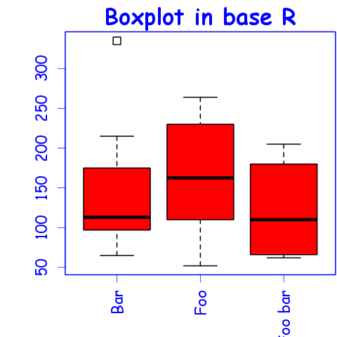](plots/graphs-35-hires.png)

### lattice

[](plots/graphs-36-hires.png)

### ggplot2

[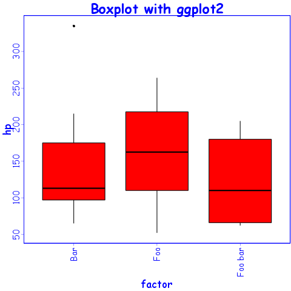](plots/graphs-37-hires.png)

## Lines

### Base R plot

[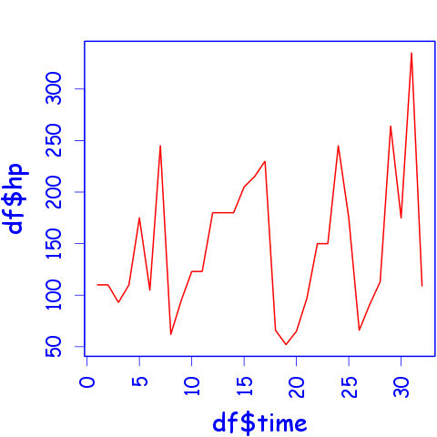](plots/graphs-38-hires.png)

### lattice

[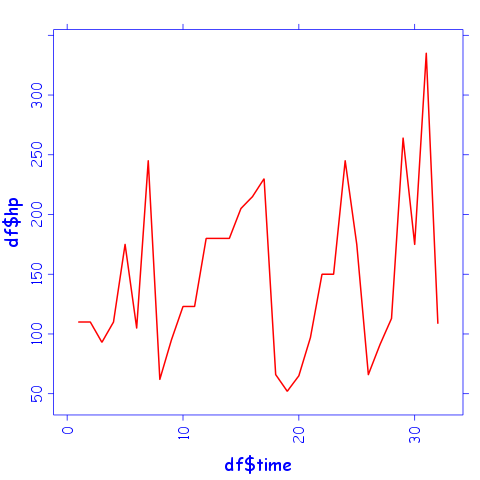](plots/graphs-39-hires.png)

### ggplot2

[](plots/graphs-40-hires.png)

 


-------
This report was generated with [R](http://www.r-project.org/) (2.15.1) and [pander](https://github.com/rapporter/pander) (0.2) in 14.579 sec on x86_64-unknown-linux-gnu platform.