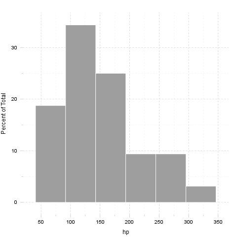
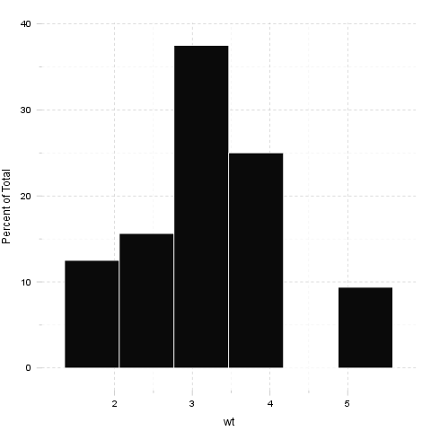
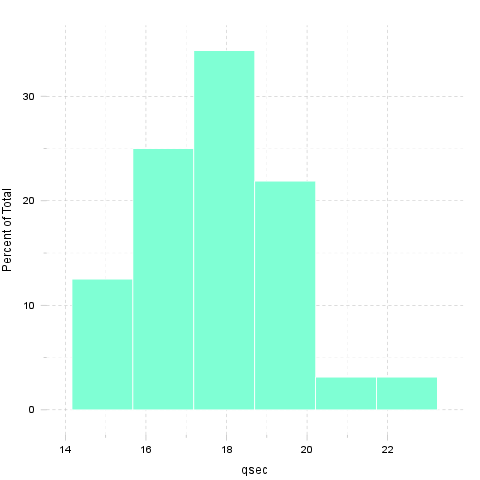
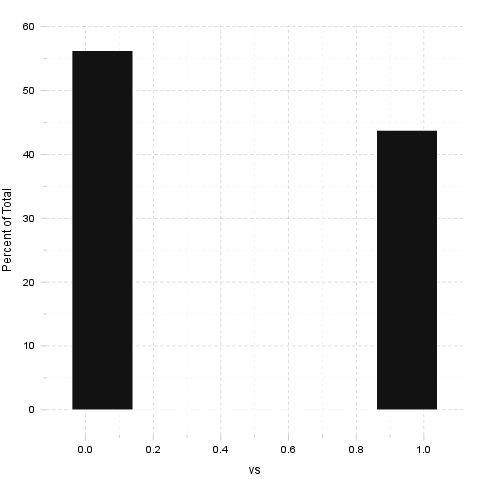
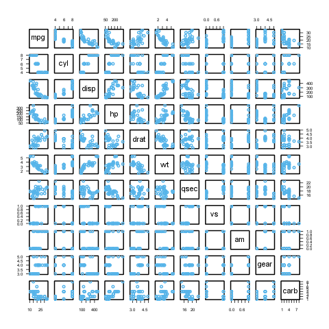

% Gergely Daróczi
% Looong report
% Mon Jun  4 00:45:22 2012

I have written the below report in 10 mins :)

# Dataset

Here I will do a pretty fast report on `mtcars` which is:

-------------------------------------------------------
                    mpg   cyl   disp   hp   drat   wt  
------------------- ----- ----- ------ ---- ------ ----
Mazda RX4           21    6     160    110  3.9    2.6 

Mazda RX4 Wag       21    6     160    110  3.9    2.9 

Datsun 710          23    4     108    93   3.9    2.3 

Hornet 4 Drive      21    6     258    110  3.1    3.2 

Hornet Sportabout   19    8     360    175  3.1    3.4 

Valiant             18    6     225    105  2.8    3.5 

Duster 360          14    8     360    245  3.2    3.6 

Merc 240D           24    4     147    62   3.7    3.2 

Merc 230            23    4     141    95   3.9    3.1 

Merc 280            19    6     168    123  3.9    3.4 

Merc 280C           18    6     168    123  3.9    3.4 

Merc 450SE          16    8     276    180  3.1    4.1 

Merc 450SL          17    8     276    180  3.1    3.7 

Merc 450SLC         15    8     276    180  3.1    3.8 

Cadillac Fleetwood  10    8     472    205  2.9    5.2 

Lincoln Continental 10    8     460    215  3.0    5.4 

Chrysler Imperial   15    8     440    230  3.2    5.3 

Fiat 128            32    4     79     66   4.1    2.2 

Honda Civic         30    4     76     52   4.9    1.6 

Toyota Corolla      34    4     71     65   4.2    1.8 

Toyota Corona       22    4     120    97   3.7    2.5 

Dodge Challenger    16    8     318    150  2.8    3.5 

AMC Javelin         15    8     304    150  3.1    3.4 

Camaro Z28          13    8     350    245  3.7    3.8 

Pontiac Firebird    19    8     400    175  3.1    3.8 

Fiat X1-9           27    4     79     66   4.1    1.9 

Porsche 914-2       26    4     120    91   4.4    2.1 

Lotus Europa        30    4     95     113  3.8    1.5 

Ford Pantera L      16    8     351    264  4.2    3.2 

Ferrari Dino        20    6     145    175  3.6    2.8 

Maserati Bora       15    8     301    335  3.5    3.6 

Volvo 142E          21    4     121    109  4.1    2.8 
-------------------------------------------------------

 
--------------------------------------------------
                    qsec   vs   am   gear   carb  
------------------- ------ ---- ---- ------ ------
Mazda RX4           16     0    1    4      4     

Mazda RX4 Wag       17     0    1    4      4     

Datsun 710          19     1    1    4      1     

Hornet 4 Drive      19     1    0    3      1     

Hornet Sportabout   17     0    0    3      2     

Valiant             20     1    0    3      1     

Duster 360          16     0    0    3      4     

Merc 240D           20     1    0    4      2     

Merc 230            23     1    0    4      2     

Merc 280            18     1    0    4      4     

Merc 280C           19     1    0    4      4     

Merc 450SE          17     0    0    3      3     

Merc 450SL          18     0    0    3      3     

Merc 450SLC         18     0    0    3      3     

Cadillac Fleetwood  18     0    0    3      4     

Lincoln Continental 18     0    0    3      4     

Chrysler Imperial   17     0    0    3      4     

Fiat 128            19     1    1    4      1     

Honda Civic         19     1    1    4      2     

Toyota Corolla      20     1    1    4      1     

Toyota Corona       20     1    0    3      1     

Dodge Challenger    17     0    0    3      2     

AMC Javelin         17     0    0    3      2     

Camaro Z28          15     0    0    3      4     

Pontiac Firebird    17     0    0    3      2     

Fiat X1-9           19     1    1    4      1     

Porsche 914-2       17     0    1    5      2     

Lotus Europa        17     1    1    5      2     

Ford Pantera L      14     0    1    5      4     

Ferrari Dino        16     0    1    5      6     

Maserati Bora       15     0    1    5      8     

Volvo 142E          19     1    1    4      2     
--------------------------------------------------

# Descriptives

-------------------------------------------------------
     Average   Median   Standard.deviation   Variance  
---- --------- -------- -------------------- ----------
mpg  20.09     19.2     6.03                 3.6e+01   

cyl  6.19      6.0      1.79                 3.2e+00   

disp 230.72    196.3    123.94               1.5e+04   

hp   146.69    123.0    68.56                4.7e+03   

drat 3.60      3.7      0.53                 2.9e-01   

wt   3.22      3.3      0.98                 9.6e-01   

qsec 17.85     17.7     1.79                 3.2e+00   

vs   0.44      0.0      0.50                 2.5e-01   

am   0.41      0.0      0.50                 2.5e-01   

gear 3.69      4.0      0.74                 5.4e-01   

carb 2.81      2.0      1.62                 2.6e+00   
-------------------------------------------------------

## In details

### mpg

We found the folloing values here:

*21*, *21*, *22.8*, *21.4*, *18.7*, *18.1*, *14.3*, *24.4*, *22.8*, *19.2*, *17.8*, *16.4*, *17.3*, *15.2*, *10.4*, *10.4*, *14.7*, *32.4*, *30.4*, *33.9*, *21.5*, *15.5*, *15.2*, *13.3*, *19.2*, *27.3*, *26*, *30.4*, *15.8*, *19.7*, *15* and *21.4*

The mean of mpg is *20.090625* while the standard deviation is: *6.0269480520891*. The most frequent value in mpg is 10.4, but let us check out the frequency table too:

-----------------------------------------------------
10.4   13.3   14.3   14.7   15   15.2   15.5   15.8  
------ ------ ------ ------ ---- ------ ------ ------
2      1      1      1      1    2      1      1     
-----------------------------------------------------

 
-----------------------------------------------------
16.4   17.3   17.8   18.1   18.7   19.2   19.7   21  
------ ------ ------ ------ ------ ------ ------ ----
1      1      1      1      1      2      1      2   
-----------------------------------------------------

 
----------------------------------------------
21.4   21.5   22.8   24.4   26   27.3   30.4  
------ ------ ------ ------ ---- ------ ------
2      1      2      1      1    1      2     
----------------------------------------------

 
-------------
32.4   33.9  
------ ------
1      1     
-------------

Tables are boring, let us show the same with a `histogram`:

### cyl

We found the folloing values here:

*6*, *6*, *4*, *6*, *8*, *6*, *8*, *4*, *4*, *6*, *6*, *8*, *8*, *8*, *8*, *8*, *8*, *4*, *4*, *4*, *4*, *8*, *8*, *8*, *8*, *4*, *4*, *4*, *8*, *6*, *8* and *4*

The mean of cyl is *6.1875* while the standard deviation is: *1.78592164694654*. The most frequent value in cyl is 8, but let us check out the frequency table too:

-----------
4   6   8  
--- --- ---
11  7   14 
-----------

Tables are boring, let us show the same with a `histogram`:

### disp

We found the folloing values here:

*160*, *160*, *108*, *258*, *360*, *225*, *360*, *146.7*, *140.8*, *167.6*, *167.6*, *275.8*, *275.8*, *275.8*, *472*, *460*, *440*, *78.7*, *75.7*, *71.1*, *120.1*, *318*, *304*, *350*, *400*, *79*, *120.3*, *95.1*, *351*, *145*, *301* and *121*

The mean of disp is *230.721875* while the standard deviation is: *123.938693831382*. The most frequent value in disp is 275.8, but let us check out the frequency table too:

------------------------------------------------------
71.1   75.7   78.7   79   95.1   108   120.1   120.3  
------ ------ ------ ---- ------ ----- ------- -------
1      1      1      1    1      1     1       1      
------------------------------------------------------

 
-----------------------------------------------------
121   140.8   145   146.7   160   167.6   225   258  
----- ------- ----- ------- ----- ------- ----- -----
1     1       1     1       2     2       1     1    
-----------------------------------------------------

 
-------------------------------------------------
275.8   301   304   318   350   351   360   400  
------- ----- ----- ----- ----- ----- ----- -----
3       1     1     1     1     1     2     1    
-------------------------------------------------

 
-----------------
440   460   472  
----- ----- -----
1     1     1    
-----------------

Tables are boring, let us show the same with a `histogram`:

### hp

We found the folloing values here:

*110*, *110*, *93*, *110*, *175*, *105*, *245*, *62*, *95*, *123*, *123*, *180*, *180*, *180*, *205*, *215*, *230*, *66*, *52*, *65*, *97*, *150*, *150*, *245*, *175*, *66*, *91*, *113*, *264*, *175*, *335* and *109*

The mean of hp is *146.6875* while the standard deviation is: *68.5628684893206*. The most frequent value in hp is 110, but let us check out the frequency table too:

---------------------------------------------
52   62   65   66   91   93   95   97   105  
---- ---- ---- ---- ---- ---- ---- ---- -----
1    1    1    2    1    1    1    1    1    
---------------------------------------------

 
-----------------------------------------------
109   110   113   123   150   175   180   205  
----- ----- ----- ----- ----- ----- ----- -----
1     3     1     2     2     3     3     1    
-----------------------------------------------

 
-----------------------------
215   230   245   264   335  
----- ----- ----- ----- -----
1     1     2     1     1    
-----------------------------

Tables are boring, let us show the same with a `histogram`:

### drat

We found the folloing values here:

*3.9*, *3.9*, *3.85*, *3.08*, *3.15*, *2.76*, *3.21*, *3.69*, *3.92*, *3.92*, *3.92*, *3.07*, *3.07*, *3.07*, *2.93*, *3*, *3.23*, *4.08*, *4.93*, *4.22*, *3.7*, *2.76*, *3.15*, *3.73*, *3.08*, *4.08*, *4.43*, *3.77*, *4.22*, *3.62*, *3.54* and *4.11*

The mean of drat is *3.5965625* while the standard deviation is: *0.534678736070971*. The most frequent value in drat is 3.07, but let us check out the frequency table too:

----------------------------------------------------
2.76   2.93   3   3.07   3.08   3.15   3.21   3.23  
------ ------ --- ------ ------ ------ ------ ------
2      1      1   3      2      2      1      1     
----------------------------------------------------

 
-----------------------------------------------------
3.54   3.62   3.69   3.7   3.73   3.77   3.85   3.9  
------ ------ ------ ----- ------ ------ ------ -----
1      1      1      1     1      1      1      2    
-----------------------------------------------------

 
-----------------------------------------
3.92   4.08   4.11   4.22   4.43   4.93  
------ ------ ------ ------ ------ ------
3      2      1      2      1      1     
-----------------------------------------

Tables are boring, let us show the same with a `histogram`:

### wt

We found the folloing values here:

*2.62*, *2.875*, *2.32*, *3.215*, *3.44*, *3.46*, *3.57*, *3.19*, *3.15*, *3.44*, *3.44*, *4.07*, *3.73*, *3.78*, *5.25*, *5.424*, *5.345*, *2.2*, *1.615*, *1.835*, *2.465*, *3.52*, *3.435*, *3.84*, *3.845*, *1.935*, *2.14*, *1.513*, *3.17*, *2.77*, *3.57* and *2.78*

The mean of wt is *3.21725* while the standard deviation is: *0.978457442989697*. The most frequent value in wt is 3.44, but let us check out the frequency table too:

---------------------------------------------------
1.513   1.615   1.835   1.935   2.14   2.2   2.32  
------- ------- ------- ------- ------ ----- ------
1       1       1       1       1      1     1     
---------------------------------------------------

 
--------------------------------------------------
2.465   2.62   2.77   2.78   2.875   3.15   3.17  
------- ------ ------ ------ ------- ------ ------
1       1      1      1      1       1      1     
--------------------------------------------------

 
--------------------------------------------------
3.19   3.215   3.435   3.44   3.46   3.52   3.57  
------ ------- ------- ------ ------ ------ ------
1      1       1       3      1      1      2     
--------------------------------------------------

 
------------------------------------------
3.73   3.78   3.84   3.845   4.07   5.25  
------ ------ ------ ------- ------ ------
1      1      1      1       1      1     
------------------------------------------

 
---------------
5.345   5.424  
------- -------
1       1      
---------------

Tables are boring, let us show the same with a `histogram`:

### qsec

We found the folloing values here:

*16.46*, *17.02*, *18.61*, *19.44*, *17.02*, *20.22*, *15.84*, *20*, *22.9*, *18.3*, *18.9*, *17.4*, *17.6*, *18*, *17.98*, *17.82*, *17.42*, *19.47*, *18.52*, *19.9*, *20.01*, *16.87*, *17.3*, *15.41*, *17.05*, *18.9*, *16.7*, *16.9*, *14.5*, *15.5*, *14.6* and *18.6*

The mean of qsec is *17.84875* while the standard deviation is: *1.78694323609684*. The most frequent value in qsec is 17.02, but let us check out the frequency table too:

---------------------------------------------------
14.5   14.6   15.41   15.5   15.84   16.46   16.7  
------ ------ ------- ------ ------- ------- ------
1      1      1       1      1       1       1     
---------------------------------------------------

 
----------------------------------------------------
16.87   16.9   17.02   17.05   17.3   17.4   17.42  
------- ------ ------- ------- ------ ------ -------
1       1      2       1       1      1      1      
----------------------------------------------------

 
-------------------------------------------------
17.6   17.82   17.98   18   18.3   18.52   18.6  
------ ------- ------- ---- ------ ------- ------
1      1       1       1    1      1       1     
-------------------------------------------------

 
--------------------------------------------------
18.61   18.9   19.44   19.47   19.9   20   20.01  
------- ------ ------- ------- ------ ---- -------
1       2      1       1       1      1    1      
--------------------------------------------------

 
--------------
20.22   22.9  
------- ------
1       1     
--------------

Tables are boring, let us show the same with a `histogram`:

### vs

We found the folloing values here:

*0*, *0*, *1*, *1*, *0*, *1*, *0*, *1*, *1*, *1*, *1*, *0*, *0*, *0*, *0*, *0*, *0*, *1*, *1*, *1*, *1*, *0*, *0*, *0*, *0*, *1*, *0*, *1*, *0*, *0*, *0* and *1*

The mean of vs is *0.4375* while the standard deviation is: *0.504016128774185*. The most frequent value in vs is 0, but let us check out the frequency table too:

-------
0   1  
--- ---
18  14 
-------

Tables are boring, let us show the same with a `histogram`:

### am

We found the folloing values here:

*1*, *1*, *1*, *0*, *0*, *0*, *0*, *0*, *0*, *0*, *0*, *0*, *0*, *0*, *0*, *0*, *0*, *1*, *1*, *1*, *0*, *0*, *0*, *0*, *0*, *1*, *1*, *1*, *1*, *1*, *1* and *1*

The mean of am is *0.40625* while the standard deviation is: *0.498990917235846*. The most frequent value in am is 0, but let us check out the frequency table too:

-------
0   1  
--- ---
19  13 
-------

Tables are boring, let us show the same with a `histogram`:

### gear

We found the folloing values here:

*4*, *4*, *4*, *3*, *3*, *3*, *3*, *4*, *4*, *4*, *4*, *3*, *3*, *3*, *3*, *3*, *3*, *4*, *4*, *4*, *3*, *3*, *3*, *3*, *3*, *4*, *5*, *5*, *5*, *5*, *5* and *4*

The mean of gear is *3.6875* while the standard deviation is: *0.737804065256947*. The most frequent value in gear is 3, but let us check out the frequency table too:

-----------
3   4   5  
--- --- ---
15  12  5  
-----------

Tables are boring, let us show the same with a `histogram`:

### carb

We found the folloing values here:

*4*, *4*, *1*, *1*, *2*, *1*, *4*, *2*, *2*, *4*, *4*, *3*, *3*, *3*, *4*, *4*, *4*, *1*, *2*, *1*, *1*, *2*, *2*, *4*, *2*, *1*, *2*, *2*, *4*, *6*, *8* and *2*

The mean of carb is *2.8125* while the standard deviation is: *1.61519997763185*. The most frequent value in carb is 2, but let us check out the frequency table too:

-----------------------
1   2   3   4   6   8  
--- --- --- --- --- ---
7   10  3   10  1   1  
-----------------------

Tables are boring, let us show the same with a `histogram`:

# Correlation

And here goes a correlation table:

-----------------------------------------------------
     mpg    cyl    disp   hp     drat   wt     qsec  
---- ------ ------ ------ ------ ------ ------ ------
mpg  1.000  -0.852 -0.848 -0.776 0.681  -0.868 0.419 

cyl  -0.852 1.000  0.902  0.832  -0.700 0.782  -0.591

disp -0.848 0.902  1.000  0.791  -0.710 0.888  -0.434

hp   -0.776 0.832  0.791  1.000  -0.449 0.659  -0.708

drat 0.681  -0.700 -0.710 -0.449 1.000  -0.712 0.091 

wt   -0.868 0.782  0.888  0.659  -0.712 1.000  -0.175

qsec 0.419  -0.591 -0.434 -0.708 0.091  -0.175 1.000 

vs   0.664  -0.811 -0.710 -0.723 0.440  -0.555 0.745 

am   0.600  -0.523 -0.591 -0.243 0.713  -0.692 -0.230

gear 0.480  -0.493 -0.556 -0.126 0.700  -0.583 -0.213

carb -0.551 0.527  0.395  0.750  -0.091 0.428  -0.656
-----------------------------------------------------

 
--------------------------------
     vs     am     gear   carb  
---- ------ ------ ------ ------
mpg  0.664  0.600  0.480  -0.551

cyl  -0.811 -0.523 -0.493 0.527 

disp -0.710 -0.591 -0.556 0.395 

hp   -0.723 -0.243 -0.126 0.750 

drat 0.440  0.713  0.700  -0.091

wt   -0.555 -0.692 -0.583 0.428 

qsec 0.745  -0.230 -0.213 -0.656

vs   1.000  0.168  0.206  -0.570

am   0.168  1.000  0.794  0.058 

gear 0.206  0.794  1.000  0.274 

carb -0.570 0.058  0.274  1.000 
--------------------------------

And the same on a graph:

Yeah, that latter took a while to render in an image file :)

That's not a `pander` issue.

# Some models

Okay, let us find out how `weight` affects other variables:

### mpg

A simple linear model: `mtcars$wt ~ mtcars$mpg`

--------------------------------------------------------
             Estimate   Std. Error   t value   Pr(>|t|) 
----------- ---------- ------------ --------- ----------
(Intercept)  6.0e+00     3.1e-01     2.0e+01   1.2e-18  

Independent  -1.4e-01    1.5e-02    -9.6e+00   1.3e-10  
--------------------------------------------------------

Table: Fitting linear model: mtcars$wt ~ Independent

### cyl

A simple linear model: `mtcars$wt ~ mtcars$cyl`

--------------------------------------------------------
             Estimate   Std. Error   t value   Pr(>|t|) 
----------- ---------- ------------ --------- ----------
(Intercept)  5.6e-01     4.0e-01     1.4e+00   1.7e-01  

Independent  4.3e-01     6.2e-02     6.9e+00   1.2e-07  
--------------------------------------------------------

Table: Fitting linear model: mtcars$wt ~ Independent

### disp

A simple linear model: `mtcars$wt ~ mtcars$disp`

--------------------------------------------------------
             Estimate   Std. Error   t value   Pr(>|t|) 
----------- ---------- ------------ --------- ----------
(Intercept)  1.6e+00     1.7e-01     9.2e+00   2.7e-10  

Independent  7.0e-03     6.6e-04     1.1e+01   1.2e-11  
--------------------------------------------------------

Table: Fitting linear model: mtcars$wt ~ Independent

### hp

A simple linear model: `mtcars$wt ~ mtcars$hp`

--------------------------------------------------------
             Estimate   Std. Error   t value   Pr(>|t|) 
----------- ---------- ------------ --------- ----------
(Intercept)  1.8e+00     3.2e-01     5.8e+00   2.4e-06  

Independent  9.4e-03     2.0e-03     4.8e+00   4.1e-05  
--------------------------------------------------------

Table: Fitting linear model: mtcars$wt ~ Independent

### drat

A simple linear model: `mtcars$wt ~ mtcars$drat`

--------------------------------------------------------
             Estimate   Std. Error   t value   Pr(>|t|) 
----------- ---------- ------------ --------- ----------
(Intercept)  7.9e+00     8.5e-01     9.3e+00   2.5e-10  

Independent  -1.3e+00    2.3e-01    -5.6e+00   4.8e-06  
--------------------------------------------------------

Table: Fitting linear model: mtcars$wt ~ Independent

### qsec

A simple linear model: `mtcars$wt ~ mtcars$qsec`

--------------------------------------------------------
             Estimate   Std. Error   t value   Pr(>|t|) 
----------- ---------- ------------ --------- ----------
(Intercept)   4.9248      1.7654     2.7896     0.0091  

Independent  -0.0957      0.0984     -0.9719    0.3389  
--------------------------------------------------------

Table: Fitting linear model: mtcars$wt ~ Independent

### vs

A simple linear model: `mtcars$wt ~ mtcars$vs`

--------------------------------------------------------
             Estimate   Std. Error   t value   Pr(>|t|) 
----------- ---------- ------------ --------- ----------
(Intercept)  3.7e+00     2.0e-01     1.9e+01   3.2e-18  

Independent  -1.1e+00    2.9e-01    -3.7e+00   9.8e-04  
--------------------------------------------------------

Table: Fitting linear model: mtcars$wt ~ Independent

### am

A simple linear model: `mtcars$wt ~ mtcars$am`

--------------------------------------------------------
             Estimate   Std. Error   t value   Pr(>|t|) 
----------- ---------- ------------ --------- ----------
(Intercept)  3.8e+00     1.6e-01     2.3e+01   1.5e-20  

Independent  -1.4e+00    2.6e-01    -5.3e+00   1.1e-05  
--------------------------------------------------------

Table: Fitting linear model: mtcars$wt ~ Independent

### gear

A simple linear model: `mtcars$wt ~ mtcars$gear`

--------------------------------------------------------
             Estimate   Std. Error   t value   Pr(>|t|) 
----------- ---------- ------------ --------- ----------
(Intercept)  6.1e+00     7.4e-01     8.2e+00   3.6e-09  

Independent  -7.7e-01    2.0e-01    -3.9e+00   4.6e-04  
--------------------------------------------------------

Table: Fitting linear model: mtcars$wt ~ Independent

### carb

A simple linear model: `mtcars$wt ~ mtcars$carb`

--------------------------------------------------------
             Estimate   Std. Error   t value   Pr(>|t|) 
----------- ---------- ------------ --------- ----------
(Intercept)  2.5e+00     3.2e-01     7.7e+00   1.4e-08  

Independent  2.6e-01     1.0e-01     2.6e+00   1.5e-02  
--------------------------------------------------------

Table: Fitting linear model: mtcars$wt ~ Independent

-------
This report was generated with [R](http://www.r-project.org/) (2.15.0) and [pander](https://github.com/daroczig/pander) (0.1) on x86_64-unknown-linux-gnu platform.